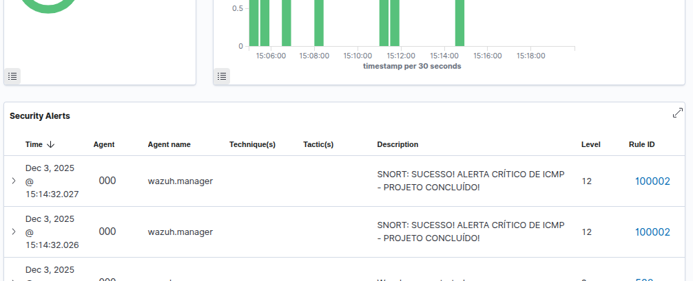

🏆 Projeto: Integração Snort & Wazuh para Alerta Crítico Customizado
Este projeto demonstra a capacidade de integrar um Intrusion Detection System (IDS) como o Snort com uma plataforma Security Information and Event Management (SIEM) como o Wazuh (em ambiente Docker), criando um alerta de alta severidade (Nível 12) a partir de um evento de rede específico (Ping ICMP).

1. 🚀 Arquitetura e Fluxo de Log
O evento seguiu um pipeline complexo. O principal desafio foi garantir que o Wazuh reconhecesse e priorizasse a SID customizada do Snort.

Snort: Captura o pacote ICMP e o loga no arquivo de alerta.

Wazuh Logcollector: Lê o arquivo em tempo real.

Wazuh Analysisd: Sobrescreve a regra genérica (20101) com a customizada (100002).

Wazuh Indexer/Dashboard: Indexa o evento com Nível 12.

2. 🎯 Configuração da Fonte de Dados
A. Inclusão no Logcollector (/var/ossec/etc/ossec.conf)
Adição da diretiva para leitura contínua do log do Snort no contêiner Manager:

XML

<localfile>
  <log_format>snort-full</log_format>
  <location>/var/log/snortlog/alert</location>
</localfile>

B. Log Bruto Capturado (SID Essencial)
O log do Snort confirmou que a Signature ID (SID) exata a ser buscada era a 1000001, conforme formatada abaixo:

[**] [1:1000001:1] [TEST] PING ICMP Detected [**]
[Priority: 0]
12/03-15:14:30.199373 10.0.0.112 -> 8.8.8.8

3. 🥇 Solução Final: Regra de Sobrescrita
A solução definitiva foi remover o decodificador customizado que causava erros de sintaxe e implementar uma regra de sobrescrita robusta que ataca a falha de prioridade do Wazuh.

Regra em /var/ossec/etc/rules/local_rules.xml

<group name="snort,">
   <rule id="100002" level="12" overwrite="yes"> 
    <if_sid>20101</if_sid> 
    <match>1:1000001:1</match> 
    <description>SNORT: SUCESSO! ALERTA CRÍTICO DE ICMP - PROJETO CONCLUÍDO!</description>
   </rule>
</group>

Desafios Críticos Superados (Key Takeaways)
Este projeto demonstrou expertise em resolução de problemas críticos de infraestrutura em ambiente Docker e configuração de serviços de segurança:

Desafio,Causa Raiz,Solução Prática
Falha Crítica de Comunicação (AxiosError / ECONNREFUSED),Sockets UNIX presos do wazuh-db dentro do container Manager (recurso compartilhado).,Limpeza forçada dos arquivos de socket (rm -f /var/ossec/queue/db/wdb) e restart do serviço.
Erros de Sintaxe no XML,"Conflitos de tags (<decoders>, <type>) no local_decoder.xml após edições, impedindo o serviço de análise de logs de iniciar.",Remoção completa do local_decoder.xml e uso exclusivo da regra de Sobrescrita por Match.
Falha na Aplicação da Regra,"A regra customizada era ignorada, e a genérica (20101) prevalecia.","Implementação de uma regra de Sobrescrita Forçada (overwrite=""yes"") combinando if_sid e match para priorizar a SID customizada."

✅ Resultado Final no Dashboard
A busca no Dashboard (agent.id: 000 AND rule.id: 100002) confirmou a aplicação da regra customizada.

