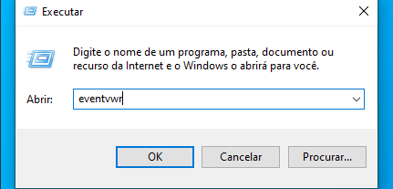
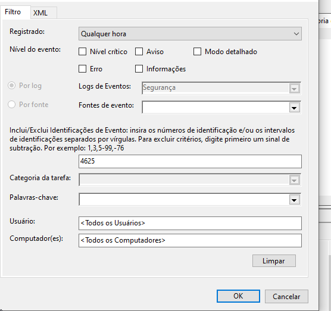
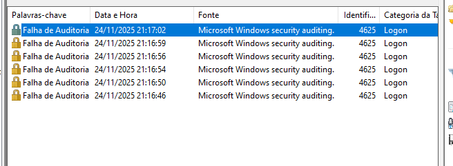

# 🔍 Projeto: Análise de Logs de Tentativa de Força Bruta (Windows)

Este projeto demonstra a capacidade de triagem, investigação e contenção de um incidente de segurança comum, usando o Visualizador de Eventos do Windows.

#### 1. 🚨 O Cenário e a Detecção (Triage)

* **Contexto:** Simulação de um alerta gerado pelo SIEM (simulado) indicando **múltiplas falhas de autenticação** para um único usuário/servidor em um curto período.
* **Ação Típica de SOC N1:** Acessar o ambiente para validação, focando no Log de Segurança do *endpoint* suspeito.

#### 2. 🔎 A Investigação e a Evidência

* **Ferramenta:** Visualizador de Eventos do Windows (Event Viewer).

  
* **Metodologia de Filtro:**
    * Focado no Log de Segurança (`Windows Logs > Security`).
    * Filtro aplicado para o **Event ID 4625** (Falha de Auditoria/Logon Failure).
* **Evidência Encontrada:** Múltiplas entradas do Event ID 4625 em rápida sucessão, conforme a imagem de auditoria:

  
* **Conclusão da Análise:** A repetição do evento `4625` em segundos comprova a **Tática T1110 (Brute Force)**, que é um método de **Acesso Inicial** no framework MITRE ATT&CK.

#### 3. 🛡️ Resposta e Contenção (Ação do Blue Team)

* **Ação Imediata (Contenção):**
    1.  Isolar a conta afetada (resetar a senha/aplicar política de bloqueio).
    2.  Notificar o usuário para confirmar a atividade.
* **Escalonamento:** Escalar o incidente para o **SOC Nível 2** ou Time de Resposta a Incidentes (IR) para que investiguem o endereço IP de origem do ataque.
* **Lição Aprendida:** O conhecimento dos IDs de evento cruciais e a disciplina de filtro são essenciais para transformar ruído em um incidente acionável.
